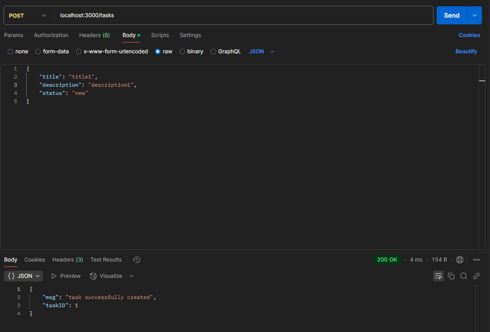
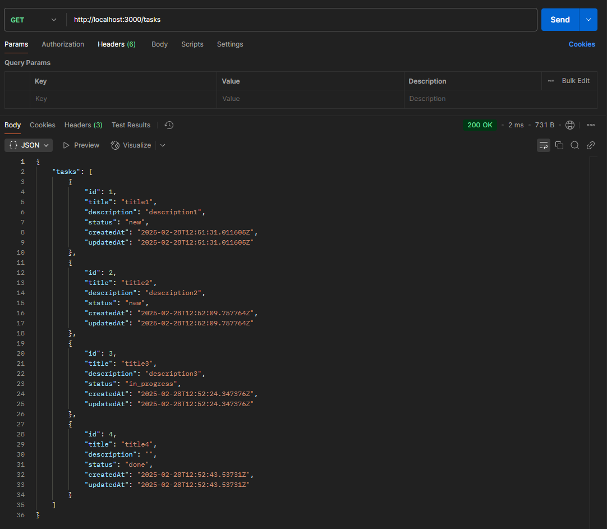
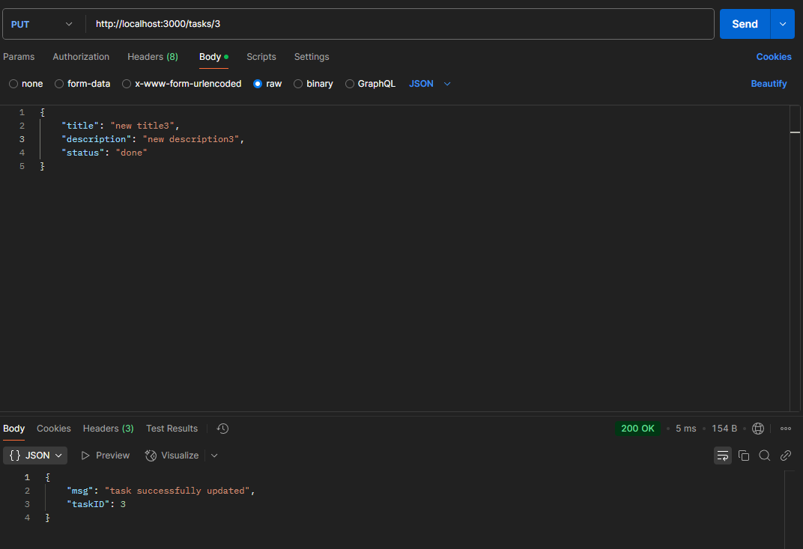
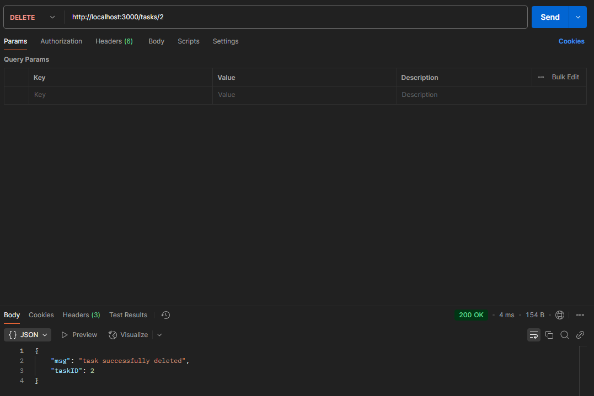
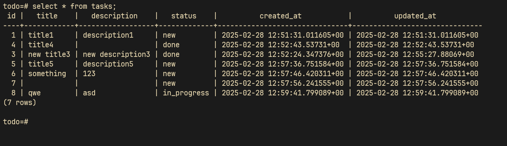

## TODO-list

## Запуск

Переменные окружения хранятся в `.env` файле.

```
docker-compose up
```

## Примеры запросов

### CreateTask



### GetTasks



### UpdateTask



### DeleteTask



### DB


